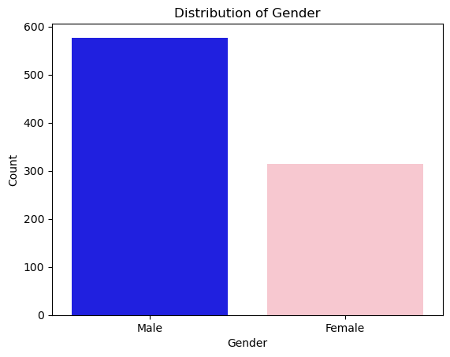
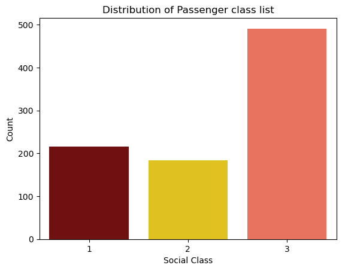
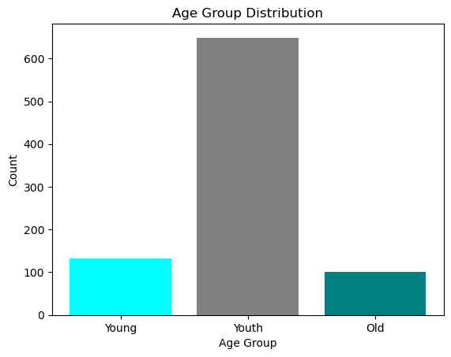
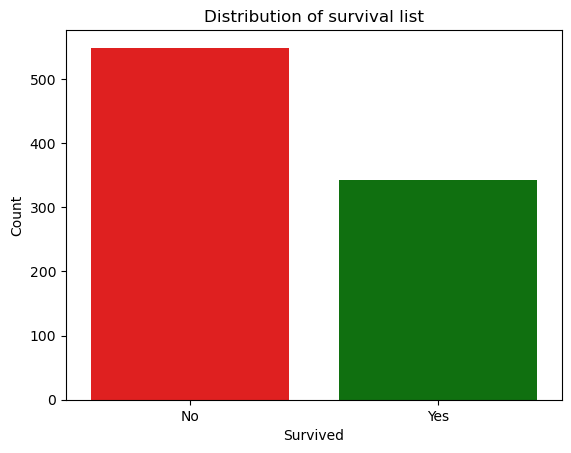
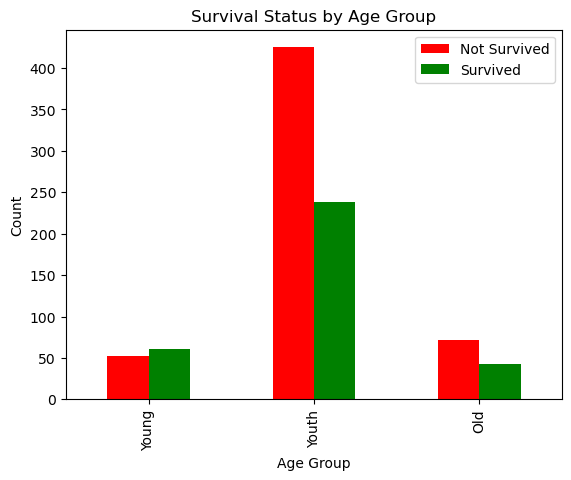
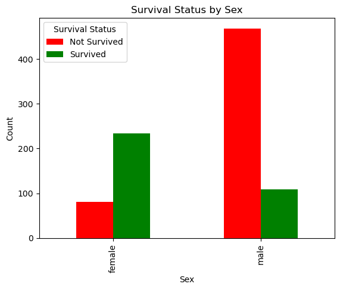
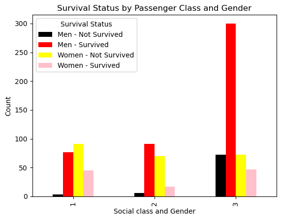
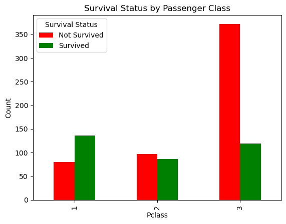

# Exploring the titanic 891   dataset

## Summary Statistics

The dataset used for this project was downloaded from https://github.com/datasciencedojo/datasets/blob/master/titanic.csv


```python
#import packages
%matplotlib inline
import numpy as np
import pandas as pd
import seaborn as sns
import matplotlib.pyplot as plt
```


```python
#import data
df1=pd.read_csv('titanic2.csv')
```


```python
#check data dimension
df1.shape
```


    (891, 12)


The results shows that the data has 12 columns and 891 rows


```python
#df.info
```


```python
#check the first 5 rows of the data
df1.head(5)
```


<div>
<style scoped>
    .dataframe tbody tr th:only-of-type {
        vertical-align: middle;
    }

    .dataframe tbody tr th {
        vertical-align: top;
    }

    .dataframe thead th {
        text-align: right;
    }
</style>
<table border="1" class="dataframe">
  <thead>
    <tr style="text-align: right;">
      <th></th>
      <th>PassengerId</th>
      <th>Survived</th>
      <th>Pclass</th>
      <th>Name</th>
      <th>Sex</th>
      <th>Age</th>
      <th>SibSp</th>
      <th>Parch</th>
      <th>Ticket</th>
      <th>Fare</th>
      <th>Cabin</th>
      <th>Embarked</th>
    </tr>
  </thead>
  <tbody>
    <tr>
      <th>0</th>
      <td>1</td>
      <td>0</td>
      <td>3</td>
      <td>Braund, Mr. Owen Harris</td>
      <td>male</td>
      <td>22.0</td>
      <td>1</td>
      <td>0</td>
      <td>A/5 21171</td>
      <td>7.2500</td>
      <td>NaN</td>
      <td>S</td>
    </tr>
    <tr>
      <th>1</th>
      <td>2</td>
      <td>1</td>
      <td>1</td>
      <td>Cumings, Mrs. John Bradley (Florence Briggs Th...</td>
      <td>female</td>
      <td>38.0</td>
      <td>1</td>
      <td>0</td>
      <td>PC 17599</td>
      <td>71.2833</td>
      <td>C85</td>
      <td>C</td>
    </tr>
    <tr>
      <th>2</th>
      <td>3</td>
      <td>1</td>
      <td>3</td>
      <td>Heikkinen, Miss. Laina</td>
      <td>female</td>
      <td>26.0</td>
      <td>0</td>
      <td>0</td>
      <td>STON/O2. 3101282</td>
      <td>7.9250</td>
      <td>NaN</td>
      <td>S</td>
    </tr>
    <tr>
      <th>3</th>
      <td>4</td>
      <td>1</td>
      <td>1</td>
      <td>Futrelle, Mrs. Jacques Heath (Lily May Peel)</td>
      <td>female</td>
      <td>35.0</td>
      <td>1</td>
      <td>0</td>
      <td>113803</td>
      <td>53.1000</td>
      <td>C123</td>
      <td>S</td>
    </tr>
    <tr>
      <th>4</th>
      <td>5</td>
      <td>0</td>
      <td>3</td>
      <td>Allen, Mr. William Henry</td>
      <td>male</td>
      <td>35.0</td>
      <td>0</td>
      <td>0</td>
      <td>373450</td>
      <td>8.0500</td>
      <td>NaN</td>
      <td>S</td>
    </tr>
  </tbody>
</table>
</div>


```python
#check the last 5 rows of the data
df1.tail(5)
```


<div>
<style scoped>
    .dataframe tbody tr th:only-of-type {
        vertical-align: middle;
    }

    .dataframe tbody tr th {
        vertical-align: top;
    }

    .dataframe thead th {
        text-align: right;
    }
</style>
<table border="1" class="dataframe">
  <thead>
    <tr style="text-align: right;">
      <th></th>
      <th>PassengerId</th>
      <th>Survived</th>
      <th>Pclass</th>
      <th>Name</th>
      <th>Sex</th>
      <th>Age</th>
      <th>SibSp</th>
      <th>Parch</th>
      <th>Ticket</th>
      <th>Fare</th>
      <th>Cabin</th>
      <th>Embarked</th>
    </tr>
  </thead>
  <tbody>
    <tr>
      <th>886</th>
      <td>887</td>
      <td>0</td>
      <td>2</td>
      <td>Montvila, Rev. Juozas</td>
      <td>male</td>
      <td>27.0</td>
      <td>0</td>
      <td>0</td>
      <td>211536</td>
      <td>13.00</td>
      <td>NaN</td>
      <td>S</td>
    </tr>
    <tr>
      <th>887</th>
      <td>888</td>
      <td>1</td>
      <td>1</td>
      <td>Graham, Miss. Margaret Edith</td>
      <td>female</td>
      <td>19.0</td>
      <td>0</td>
      <td>0</td>
      <td>112053</td>
      <td>30.00</td>
      <td>B42</td>
      <td>S</td>
    </tr>
    <tr>
      <th>888</th>
      <td>889</td>
      <td>0</td>
      <td>3</td>
      <td>Johnston, Miss. Catherine Helen "Carrie"</td>
      <td>female</td>
      <td>NaN</td>
      <td>1</td>
      <td>2</td>
      <td>W./C. 6607</td>
      <td>23.45</td>
      <td>NaN</td>
      <td>S</td>
    </tr>
    <tr>
      <th>889</th>
      <td>890</td>
      <td>1</td>
      <td>1</td>
      <td>Behr, Mr. Karl Howell</td>
      <td>male</td>
      <td>26.0</td>
      <td>0</td>
      <td>0</td>
      <td>111369</td>
      <td>30.00</td>
      <td>C148</td>
      <td>C</td>
    </tr>
    <tr>
      <th>890</th>
      <td>891</td>
      <td>0</td>
      <td>3</td>
      <td>Dooley, Mr. Patrick</td>
      <td>male</td>
      <td>32.0</td>
      <td>0</td>
      <td>0</td>
      <td>370376</td>
      <td>7.75</td>
      <td>NaN</td>
      <td>Q</td>
    </tr>
  </tbody>
</table>
</div>


```python
# Check for missing values
missing_values = df1.isnull()

# Count the number of missing values in each column
missing_counts = missing_values.sum()

# Print the columns with missing values and their respective counts
print(missing_counts[missing_counts > 0])
```

    Age         177
    Cabin       687
    Embarked      2
    dtype: int64
    

The above output shows that the Age, Embarked and Cabin variables has NA values which can result in poor analysis.


```python
#dropping the Cabin column
df = df1.drop(columns=["Cabin"])
```


```python
#Replacing the missing ages with the mean
df['Age'] = df['Age'].fillna(df['Age'].mean())

# Now, 'Age' column has missing values imputed with the mean

# Check if there are any remaining missing values
missing_values_count = df['Age'].isnull().sum()
print(f"Number of missing values in 'Age' after imputation: {missing_values_count}")

```

    Number of missing values in 'Age' after imputation: 0
    


```python
# Check for missing values AGAIN
missing_values1 = df.isnull()

# Count the number of missing values in each column
missing_counts1 = missing_values1.sum()

# Print the columns with missing values and their respective counts
print(missing_counts1[missing_counts1 > 0])
```

    Embarked    2
    dtype: int64
    


```python
#summary statistics to describe the distribution of the data
df.describe()
```


<div>
<style scoped>
    .dataframe tbody tr th:only-of-type {
        vertical-align: middle;
    }

    .dataframe tbody tr th {
        vertical-align: top;
    }

    .dataframe thead th {
        text-align: right;
    }
</style>
<table border="1" class="dataframe">
  <thead>
    <tr style="text-align: right;">
      <th></th>
      <th>PassengerId</th>
      <th>Survived</th>
      <th>Pclass</th>
      <th>Age</th>
      <th>SibSp</th>
      <th>Parch</th>
      <th>Fare</th>
    </tr>
  </thead>
  <tbody>
    <tr>
      <th>count</th>
      <td>891.000000</td>
      <td>891.000000</td>
      <td>891.000000</td>
      <td>891.000000</td>
      <td>891.000000</td>
      <td>891.000000</td>
      <td>891.000000</td>
    </tr>
    <tr>
      <th>mean</th>
      <td>446.000000</td>
      <td>0.383838</td>
      <td>2.308642</td>
      <td>29.699118</td>
      <td>0.523008</td>
      <td>0.381594</td>
      <td>32.204208</td>
    </tr>
    <tr>
      <th>std</th>
      <td>257.353842</td>
      <td>0.486592</td>
      <td>0.836071</td>
      <td>13.002015</td>
      <td>1.102743</td>
      <td>0.806057</td>
      <td>49.693429</td>
    </tr>
    <tr>
      <th>min</th>
      <td>1.000000</td>
      <td>0.000000</td>
      <td>1.000000</td>
      <td>0.420000</td>
      <td>0.000000</td>
      <td>0.000000</td>
      <td>0.000000</td>
    </tr>
    <tr>
      <th>25%</th>
      <td>223.500000</td>
      <td>0.000000</td>
      <td>2.000000</td>
      <td>22.000000</td>
      <td>0.000000</td>
      <td>0.000000</td>
      <td>7.910400</td>
    </tr>
    <tr>
      <th>50%</th>
      <td>446.000000</td>
      <td>0.000000</td>
      <td>3.000000</td>
      <td>29.699118</td>
      <td>0.000000</td>
      <td>0.000000</td>
      <td>14.454200</td>
    </tr>
    <tr>
      <th>75%</th>
      <td>668.500000</td>
      <td>1.000000</td>
      <td>3.000000</td>
      <td>35.000000</td>
      <td>1.000000</td>
      <td>0.000000</td>
      <td>31.000000</td>
    </tr>
    <tr>
      <th>max</th>
      <td>891.000000</td>
      <td>1.000000</td>
      <td>3.000000</td>
      <td>80.000000</td>
      <td>8.000000</td>
      <td>6.000000</td>
      <td>512.329200</td>
    </tr>
  </tbody>
</table>
</div>


```python
#Summary of the categorical variables
categorical = df.dtypes[df.dtypes == "object"].index
print(categorical)

df[categorical].describe()
```

    Index(['Name', 'Sex', 'Ticket', 'Embarked'], dtype='object')
    


<div>
<style scoped>
    .dataframe tbody tr th:only-of-type {
        vertical-align: middle;
    }

    .dataframe tbody tr th {
        vertical-align: top;
    }

    .dataframe thead th {
        text-align: right;
    }
</style>
<table border="1" class="dataframe">
  <thead>
    <tr style="text-align: right;">
      <th></th>
      <th>Name</th>
      <th>Sex</th>
      <th>Ticket</th>
      <th>Embarked</th>
    </tr>
  </thead>
  <tbody>
    <tr>
      <th>count</th>
      <td>891</td>
      <td>891</td>
      <td>891</td>
      <td>889</td>
    </tr>
    <tr>
      <th>unique</th>
      <td>891</td>
      <td>2</td>
      <td>681</td>
      <td>3</td>
    </tr>
    <tr>
      <th>top</th>
      <td>Braund, Mr. Owen Harris</td>
      <td>male</td>
      <td>347082</td>
      <td>S</td>
    </tr>
    <tr>
      <th>freq</th>
      <td>1</td>
      <td>577</td>
      <td>7</td>
      <td>644</td>
    </tr>
  </tbody>
</table>
</div>


### Exploring the name variable


```python
#sorting names
sorted(df["Name"])[0:15]
```


    ['Abbing, Mr. Anthony',
     'Abbott, Mr. Rossmore Edward',
     'Abbott, Mrs. Stanton (Rosa Hunt)',
     'Abelson, Mr. Samuel',
     'Abelson, Mrs. Samuel (Hannah Wizosky)',
     'Adahl, Mr. Mauritz Nils Martin',
     'Adams, Mr. John',
     'Ahlin, Mrs. Johan (Johanna Persdotter Larsson)',
     'Aks, Mrs. Sam (Leah Rosen)',
     'Albimona, Mr. Nassef Cassem',
     'Alexander, Mr. William',
     'Alhomaki, Mr. Ilmari Rudolf',
     'Ali, Mr. Ahmed',
     'Ali, Mr. William',
     'Allen, Miss. Elisabeth Walton']


```python
#name variable summary
df["Name"].describe()
```


    count                         891
    unique                        891
    top       Braund, Mr. Owen Harris
    freq                            1
    Name: Name, dtype: object


The output shows that there are 418 unique names starting with Mr. Owen Harris Braund

### Exploring the sex (Gender) distribution


```python
#uniqueness of the Sex variable
df["Sex"].unique()
#df["Sex"].value_counts()
```


    array(['male', 'female'], dtype=object)


```python
# Calculate the count of each Gender category
Gender_counts = df['Sex'].value_counts()
print(Gender_counts)
# visualizing gender distribution using a bar chart
sns.barplot(x=Gender_counts.index, y=Gender_counts.values, palette=['blue', 'pink'])
plt.xlabel('Gender')
plt.ylabel('Count')
plt.title('Distribution of Gender')
plt.xticks(ticks=[0, 1], labels=['Male', 'Female'])
plt.show()

```

    male      577
    female    314
    Name: Sex, dtype: int64
    


    

    


Out of the 418 sampled passengers, 577 were men and 314 were women

### Exploring the passengers  class


```python
#displaying the type and total number of ticket classes purchased by the 418 passenges of the titanic ship  
df["Pclass"].unique()

pc = df["Pclass"].value_counts()
print(pc)
```

    3    491
    1    216
    2    184
    Name: Pclass, dtype: int64
    

According to the output:
216 passengers purchased the first class ticket,
184 passengers purchased the second class ticket and
491 passengers purchased the third class ticket as shown in the graph below


```python
# visualizing the distribution of Passenger class list using a bar chart
sns.barplot(x=pc.index, y=pc.values, palette=['Maroon', 'Gold', 'Tomato'])
plt.xlabel('Social Class')
plt.ylabel('Count')
plt.title('Distribution of Passenger class list')
plt.xticks(ticks=[0, 1, 2], labels=['1', '2', '3'])
plt.show()

```


    

    


### Exploring the age group variable 


```python
x = df["Age"].mean()
y = df["Age"].mode()
z = df["Age"].median()
print("the mean value for the age variable is", x)
print("the modal age is", y)
print("the median value for the age variable is ", z)
```

    the mean value for the age variable is 29.69911764705882
    the modal age is 0    29.699118
    Name: Age, dtype: float64
    the median value for the age variable is  29.69911764705882
    


```python
#Age group count
young = df['Age'].between(1, 18).sum()
youth = df['Age'].between(19, 45).sum()
old = df['Age'].between(46, 100).sum()

print(f"{young} out of the {len(df)} sampled passengers were young i.e 1 to 18 years")
print(f"{youth} out of the {len(df)} sampled passengers were youth i.e 19 to 45 years old")
print(f"{old} out of the {len(df)} sampled passengers were old people i.e 46 to 100 years old")
```

    132 out of the 891 sampled passengers were young i.e 1 to 18 years
    649 out of the 891 sampled passengers were youth i.e 19 to 45 years old
    101 out of the 891 sampled passengers were old people i.e 46 to 100 years old
    


```python
#who was the oldest passenger aboard the ship?
oldest = df["Age"].max()
youngest = df["Age"].min()
print(f"The oldest passenger among the {len(df)} sampled passengers on the ship was {oldest}")
print(f"The youngest passenger among the {len(df)} sampled passengers on the ship was {youngest}")
```

    The oldest passenger among the 891 sampled passengers on the ship was 80.0
    The youngest passenger among the 891 sampled passengers on the ship was 0.42
    


```python
# Plot a bar chart
age_groups = ['Young', 'Youth', 'Old']
counts = [young, youth, old]

plt.bar(age_groups, counts, color=['aqua', 'gray', 'teal'])
plt.xlabel('Age Group')
plt.ylabel('Count')
plt.title('Age Group Distribution')
plt.show()

```


    

    


###  Exploring the Survived variable


```python
#Total number of unique records from the survived variable
df["Survived"].unique()
survival_count = df["Survived"].value_counts()
print(survival_count)
```

    0    549
    1    342
    Name: Survived, dtype: int64
    

The results shows that, out of the 891 passengers, 549 passengers died while 342 survived as represented on the graph below


```python
# visualizing the distribution of survived list using a bar chart
sns.barplot(x=survival_count.index, y=survival_count.values, palette=['red', 'green'])
plt.xlabel('Survived')
plt.ylabel('Count')
plt.title('Distribution of survival list')
plt.xticks(ticks=[0, 1], labels=['No', 'Yes'])
plt.show()

```


    

    


### Survived distribution by age group (Young, Youth, and Old)


```python
bins = [0, 18, 45, 100]
labels = ['Young', 'Youth', 'Old']

# Create Age Group column
df['AgeGroup'] = pd.cut(df['Age'], bins=bins, labels=labels, right=False)

# Group by Age Group and Survived, then count occurrences
age_survival_counts = df.groupby(['AgeGroup', 'Survived']).size().unstack(fill_value=0)

# Print counts
for age_group in labels:
    not_survived_count = age_survival_counts.loc[age_group, 0]
    survived_count = age_survival_counts.loc[age_group, 1]
    total_count = not_survived_count + survived_count
    print(f"{not_survived_count} out of {total_count} in {age_group} did not survive")
    print(f"{survived_count} out of {total_count} in {age_group} survived")

# Access and print the total number of youth that survived
youth_survived_count = age_survival_counts.loc['Youth', 1]
print(f"Total number of youth that survived: {youth_survived_count}")

# Plot a stacked bar chart
age_survival_counts.plot(kind='bar', stacked=False, color=['red', 'green'])
plt.xlabel('Age Group')
plt.ylabel('Count')
plt.title('Survival Status by Age Group')
plt.legend(['Not Survived', 'Survived'])
plt.show()

```

    52 out of 113 in Young did not survive
    61 out of 113 in Young survived
    425 out of 663 in Youth did not survive
    238 out of 663 in Youth survived
    72 out of 115 in Old did not survive
    43 out of 115 in Old survived
    Total number of youth that survived: 238
    


    

    


### Survived distribution by  gender 


```python
# Assuming you have a DataFrame called df with 'Age', 'Survived', 'Sex' columns
bins = [0, 18, 45, 100]
labels = ['Young', 'Youth', 'Old']

# Group by Age Group, Sex, and Survived, then count occurrences
grouped_counts = df.groupby(['Sex', 'Survived']).size().unstack(fill_value=0)

# Print counts
for sex in df['Sex'].unique():
    not_survived_count = grouped_counts.loc[sex, 0]
    survived_count = grouped_counts.loc[sex, 1]
    total_count = not_survived_count + survived_count
    print(f"{not_survived_count} out of {total_count} {sex} did not survive")
    print(f"{survived_count} out of {total_count} {sex} survived")

# Access and print the total number of men that survived
men_survived_count = grouped_counts.loc['male', 1]
print(f"Total number of men that survived: {men_survived_count}")

# Access and print the total number of women that survived
women_survived_count = grouped_counts.loc['female', 1]
print(f"Total number of women that survived: {women_survived_count}")

# Plot a stacked bar chart
grouped_counts.loc[:, [0, 1]].plot(kind='bar', stacked=False, color=['red', 'green'])
plt.xlabel('Sex')
plt.ylabel('Count')
plt.title('Survival Status by Sex')
plt.legend(['Not Survived', 'Survived'], title='Survival Status')
plt.show()

```

    468 out of 577 male did not survive
    109 out of 577 male survived
    81 out of 314 female did not survive
    233 out of 314 female survived
    Total number of men that survived: 109
    Total number of women that survived: 233
    


    

    


### Survived distribution by gender and social class 


```python
# Group by Pclass, Sex, and Survived, then count occurrences
grouped_counts_pclass = df.groupby(['Pclass', 'Sex', 'Survived']).size().unstack(fill_value=0)

# Print counts
for pclass in df['Pclass'].unique():
    for sex in df['Sex'].unique():
        not_survived_count = grouped_counts_pclass.loc[(pclass, sex), 0]
        survived_count = grouped_counts_pclass.loc[(pclass, sex), 1]
        total_count = not_survived_count + survived_count
        print(f"{not_survived_count} out of {total_count} {sex} in class {pclass} did not survive")
        print(f"{survived_count} out of {total_count} {sex} in cclass {pclass} survived")

# Access and print the total number of men that survived in each class
for pclass in df['Pclass'].unique():
    men_survived_count = grouped_counts_pclass.loc[(pclass, 'male'), 1]
    print(f"Total number of men that survived in class {pclass}: {men_survived_count}")

# Access and print the total number of women that survived in each class
for pclass in df['Pclass'].unique():
    women_survived_count = grouped_counts_pclass.loc[(pclass, 'female'), 1]
    print(f"Total number of women that survived in class {pclass}: {women_survived_count}")

# Plot a stacked bar chart
#grouped_counts_pclass.loc[:, [0, 1]].unstack().plot(kind='bar', stacked=True, color=['red', 'green'])
#plt.xlabel('Gender and Social class')
#plt.ylabel('Count')
#plt.title('Survival Status by Passenger Class and Gender')
#plt.legend(['Not Survived', 'Survived'], title='Survival Status')
#plt.show()


# Group by Pclass, Sex, and Survived, then count occurrences
#grouped_counts_pclass = df.groupby(['Pclass', 'Sex', 'Survived']).size().unstack(fill_value=0)

# Plot a stacked bar chart
ax = grouped_counts_pclass.loc[:, [0, 1]].unstack().plot(kind='bar', stacked=False, color=['black', 'red', 'yellow', 'pink'])
plt.xlabel('Passenger class and Gender')
plt.ylabel('Count')
plt.title('Survival Status by Passenger Class and Gender')
plt.legend(['Men - Not Survived', 'Men - Survived', 'Women - Not Survived', 'Women - Survived'], title='Survival Status')
plt.show()

```

    300 out of 347 male in class 3 did not survive
    47 out of 347 male in cclass 3 survived
    72 out of 144 female in class 3 did not survive
    72 out of 144 female in cclass 3 survived
    77 out of 122 male in class 1 did not survive
    45 out of 122 male in cclass 1 survived
    3 out of 94 female in class 1 did not survive
    91 out of 94 female in cclass 1 survived
    91 out of 108 male in class 2 did not survive
    17 out of 108 male in cclass 2 survived
    6 out of 76 female in class 2 did not survive
    70 out of 76 female in cclass 2 survived
    Total number of men that survived in class 3: 47
    Total number of men that survived in class 1: 45
    Total number of men that survived in class 2: 17
    Total number of women that survived in class 3: 72
    Total number of women that survived in class 1: 91
    Total number of women that survived in class 2: 70
    


    

    


```python
# Group by Pclass and Survived, then count occurrences
grouped_counts_pclass = df.groupby(['Pclass', 'Survived']).size().unstack(fill_value=0)

# Print counts
for pclass in df['Pclass'].unique():
    not_survived_count = grouped_counts_pclass.loc[pclass, 0]
    survived_count = grouped_counts_pclass.loc[pclass, 1]
    total_count = not_survived_count + survived_count
    print(f"{not_survived_count} out of {total_count} in {pclass} class did not survive")
    print(f"{survived_count} out of {total_count} in {pclass} class survived")

# Access and print the total number of passengers that survived in each class
for pclass in df['Pclass'].unique():
    total_survived_count = grouped_counts_pclass.loc[pclass, 1]
    print(f"Total number of passengers that survived in  {pclass}class: {total_survived_count}")

# Plot a stacked bar chart
grouped_counts_pclass.plot(kind='bar', stacked=False, color=['red', 'green'])
plt.xlabel('Pclass')
plt.ylabel('Count')
plt.title('Survival Status by Passenger Class')
plt.legend(['Not Survived', 'Survived'], title='Survival Status')
plt.show()

```

    372 out of 491 in 3 class did not survive
    119 out of 491 in 3 class survived
    80 out of 216 in 1 class did not survive
    136 out of 216 in 1 class survived
    97 out of 184 in 2 class did not survive
    87 out of 184 in 2 class survived
    Total number of passengers that survived in  3class: 119
    Total number of passengers that survived in  1class: 136
    Total number of passengers that survived in  2class: 87
    


    

    


```python
import matplotlib.pyplot as plt

# Group by Pclass, Sex, and Survived, then count occurrences
grouped_counts_pclass = df.groupby(['Pclass', 'Sex', 'Survived']).size().unstack(fill_value=0)

# Unstack the data for each survival status
unstacked_data = grouped_counts_pclass.unstack().unstack()

# Plot a bar chart
ax = unstacked_data.plot(kind='bar', color=['black', 'red', 'yellow', 'pink'], stacked=True)
plt.xlabel('Social class and Gender')
plt.ylabel('Count')
plt.title('Survival Status by Passenger Class and Gender')
plt.legend(['Men - Not Survived', 'Men - Survived', 'Women - Not Survived', 'Women - Survived'], title='Survival Status')
plt.show()

```
